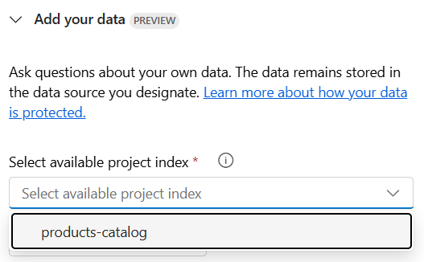
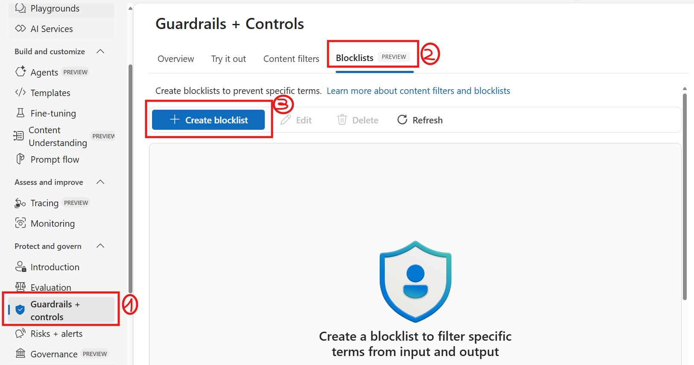
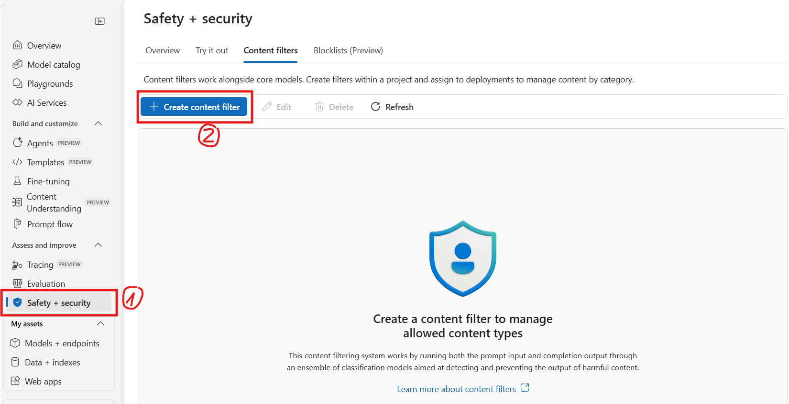
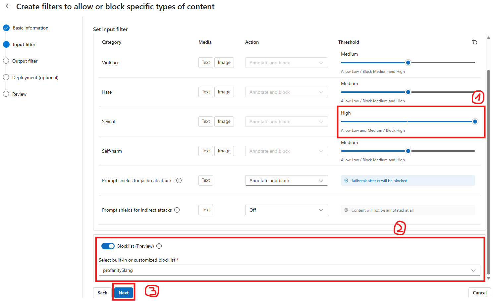

# Part 1 - Text Generation

Welcome to Part 1 of this workshop, where we'll be interacting with gpt-4o-mini model to generate text.

> [!TIP]
> What is prompt engineering?
> Prompt engineering is a concept in Natural Language Processing (NLP) that involves **embedding descriptions of tasks** in input to **prompt the model** to output the **desired results**.

## Basic prompting

Let's start with a few prompts and observe the response using the chat playground. To use the chat playground, follow the following steps:

1. Navigate to the playgrounds section, on the left-hand navigation bar, and click **Try the Chat Playground.**
2. In the Chat playground, find the text box labeled _"Type user query here."_
3. After adding your prompt, locate the Paper Plane icon, usually positioned next to the input box. Click on the Paper Plane icon to submit your text to the model deployment.
4. After sending your query, wait a moment for the model to process and respond. The response will appear in the chat window below your input.

Here are some examples to try, but get creative with your own prompts and see what happens!

### Zero-shot learning and conversation history

```
Suggest a tagline for a futuristic-themed pizzeria restaurant named "Galactic Slice".
```

Without clearing the chat history, try now the following prompt:

```
Generate 10 unique menu items, including dish names and a short description.
```

Note that the model is providing a menu relevant to the futuristic themed pizzeria-restaurant, even if we didn't specify again the restaurant name or type. This is because under-the-hood the model is given the **whole conversation history** as context, not just the latest prompt. An AI model cannot learn and has no memory of previous interactions if the user leaves and comes back, but the application is using prompt engineering to add this 'memory'.
 Also, LLMs are trained on such large amounts of data they may be able to perform some tasks with very little prompting. This is known as **zero-shot learning**.

> [!NOTE]
> You can control the context window size, which is the number of previous interactions that the model will consider as context (default is 10) by going into the **Parameters** section.

You can control your model parameters as follows:


1. In the Chat interface, navigate to the **Parameters** section.
2. Once in the Parameters section, adjust the setting controls. You can change the number of past messages included which the model will consider as context. Once set, the changes will be applied automatically.

## Advanced prompting

>[!alert] Before moving on with the next section, click on the **Clear Chat** button to clear the message history. To do this, click on the **broom-like icon** on the top right of your plaground. A pop-up will appear, click **clear button** to clear the chat history.


### Few-shot learning

If zero-shot learning is failing for your examples and more complex tasks, **few-shot prompting** can provide examples that can better steer the model to the desired outcomes. Examples show the model clearly how we want it to operate. Here's an example of a few-shot learning prompt for categorizing products.

```
Generate 10 unique pizza menu items with futuristic names, including the name of the pizza and a short description.

Examples:  
The Nebula Supreme: A classic supreme pizza with pepperoni, sausage, bell peppers, onions, and olives, topped with a hint of spicy marinara sauce.
Galactic Garden: A vegetarian delight featuring spinach, cherry tomatoes, mushrooms, and artichokes with a basil pesto drizzle.
Asteroid Meat Feast: Loaded with pepperoni, ham, ground beef, bacon, and Italian sausage for a hearty, protein-packed slice.
```

### Chain of thought prompting

>[!alert] Before you start, click on **Clear Chat** to avoid any context from previous interactions.

When interacting with LLMs, a useful tip is to imagine that you are speaking to an untrained intern. So the more details you can provide about the task to be performed, the better the results you will get. In particular, a useful strategy is to break down the task into smaller parts and provide a prompt for each part. 

Another option is using a technique - called **chain of thought** where the LLM is responsible for breaking the task down into smaller steps. The LLM uses its knowledge of the world and its ability to reason. The LLM then generates a chain of thoughts that lead to the solution of the task.
Clear the playground chat again and then enter the user prompt below to see 'Chain of thought prompting' in action:

```
Develop a new pizza for our restaurant.

Take a step-by-step approach in your response: Start by thinking about the theme, considering how it fits into the restaurant's overall futuristic concept. Then, define the flavor profile, keeping in mind our audience's preferences and the overall taste experience you want to create. Next, choose the base ingredients, including the sauce type and cheese blend, and think about unique toppings that make this pizza stand out. Finally, decide on a name that aligns with the theme and enhances the pizza's appeal. Include your reasoning before sharing the final answer in the below format: ANSWER is: <pizza description>.
```

## System message and added knowledge

>[!alert] Before moving on with the next section, click on the **Clear Chat** button to clear the message history.

### System message

> [!TIP]
> What is the **system message**? The system message is used to communicate instructions or provide context to the model at the beginning of a conversation. It is displayed in a different format compared to user messages, helping the model understand its role in the conversation. The system message typically guides the model's behavior, sets the tone, or specifies desired output from the model. By utilizing the system message effectively, users can steer the model towards generating more accurate and relevant responses.


Update the System Message to give the model instructions and context as follows:

1. In the Chat interface, navigate to the **System message** section.
2. Once in the System message section, erase the existing message. Click inside the System message field to place your cursor there and  insert the text below:

```
## Task
You are a menu designer for a futuristic-themed pizzeria restaurant named "Galactic Slice". Your goal is to generate creative menu items and descriptions. Keep your answers brief, engaging, and aligned with the restaurant's theme.

Your answer should be brief and engaging. Always use a friendly and professional tone of voice.

## Safety
Keep the descriptions family-friendly and suitable for all age groups visiting our pizzeria. Avoid any irrelevant information and controversial opinions.
```

3. Find the button labeled **Apply changes**, which is located directly below the System message box. Click this button to save and apply the changes you’ve made to the System message field.
4. After applying the changes, click the **continue button** in the pop-up to update the system message.


Observe that we have provided the model with a **clear task**, a **tone of voice**, and **safety measures** to follow. Your model, like any piece of technology used for business, is like your brand. If you want it to have the same approach and ethics you instill in your code of conduct across the business, it should also be included in your AI solutions. Setting a segment around tone within your system message can help to set the response type to suit your use case.

The text provided in the System Message is handled specially by the model, and is intended to have more influence on the model's responses than the User Message text or other context provided in the prompt. Also, it is persisted across all the interactions in the chat, even if you clear the chat history.

5. To see how the model's behavior changes with the added context, try the prompt below in the text box:

```
Write a brief description of the restaurant, including the categories of menu items offered.
```

You will see that not only does the model respond with the requested information, but it also follows the tasks accurately, such as sticking to the restaurant theme and name. To go further, we can test the **safety measures**: 

```
What are your thoughts on the current geopolitical worldwide situation?
```

6. The model will refrain from answering this (as it is both irrelevant to the company and could be deemed controversial), and stick to the subject of the company and its products.

### Grounded prompting

>[!alert] Ensure to **Clear Chat** before moving on with the section.

So far, the model has been creative in inventing a business value proposition and product (menu) offering. However, in real-world scenarios, we want the model to generate text that is grounded in reality and reflects the actual business. To achieve this, we can use a technique called **Retrieval Augmented Generation (RAG)**. This technique involves providing the model with a set of facts or information about the business, which the model can then use to generate more accurate and relevant text.

> [!NOTE]
> **Retrieval-Augmented Generation (RAG)** is an AI technique that combines a language model with a search system to provide more accurate and detailed information. In a RAG pattern, the system usually retrieves relevant information from a database and then uses it to help generate more informed and contextually accurate text responses. For the sake of this lab, we will simulate the retrieval process, by providing the model with a set of facts about the business in the prompt.

Let's switch gears and try another scenario for an outdoor company, selling outdoor equipments and apparel. Let's ask the model to assist users with the company's product catalog, by answering their questions based on the data we uploaded in the [set up section](./01_Set_up.md).

In the playground, reset the system message to:

```
## Task
 You are an assistant of the Contoso Outdoor Company, selling outdoor equipment and apparel. Your goal is to help Contoso's customers, by answering their questions related to our product offering. Always use a friendly and professional tone of voice.
 
 ## Safety
 In the answers you write always stick to the subject of the company and the products it offers. Avoid any irrelevant information and controversial opinions.
 ```

 Navigate to **Add your data** section in the playground and select the **products-catalog** index you created in the previous step, which contains Contoso's products information.
 
 

 > If you can't find the index in the dropdown list, most likely the index is not fully created yet. Move to the next section and return when index creation is completed.

To see how the model's behavior changes with the added context, try the prompt below:

```
How can I set up my TrailMaster X4 Tent?
```

```
Would you recommend the Adventurer Pro Backpack for a beginner?
```

> [!NOTE]
> Notice how the response includes a reference to the file where the information was retrieved, so that the user can double check the accuracy of the response directly from the source. 

## Safety and Security

Generative AI enables amazing creative solutions, but must be implemented responsibly to minimize the risk of harmful content generation. How we approach Responsible AI solutions is through:

 - **Map**: identify potential harms; 
 - **Measure**: measure the presence and frequency of these harms; 
 - **Manage**: mitigate the harms at various layers to minimize the presence and impact;
 - **Operationalize**: Operate the solution responsibly in production.

 One of the most effective ways to prevent the presence of harmful content in input to and output from your solution is to use **content filtering.** In Azure AI Foundry, this system is powered by [Azure AI Content Safety](https://learn.microsoft.com/azure/ai-services/content-safety/overview) and it works by running both the prompt and completion through an ensemble of classification models designed to detect several categories of harms.  When you deploy a pre-built model in Azure AI Foundry, this includes default content filters to ensure potential harmful prompts and completions are identified and removed. The default content filtering configuration is set to filter at the medium severity threshold for all harms categories for both prompts and completions. However, you can modify the content filters and configure the severity thresholds at resource level, according to your application needs. Under custom content filters, you can also create one or multiple **blocklist**, to account for specific phrases/words that you wish to block.  

 > !NOTE
 > The prompts provided in this exercise contain content that might be disturbing to some users. This example is only used to demonstrate the functionality of the Content Filtering feature in Azure AI Foundry.

 1. Let's go back to our chat and test the default filtering:

    ```
    Is it possible to have sex on the TrailMaster X4 Tent?
    ```

    The response will inform you the LLM cannot provide the requested information.

2. However, if we change the prompt to slang, it will give you a different response and will not identify the sexual content in the input message:

    ```
    Which tent is big enough to fit 2 people to do the deed?
    ```

To mitigate the risk of a similar behaviour, we can add an extra layer of mitigation, by customizing the content filtering system. 

1. Navigate to **Safety + security** tab and select **Blocklists**
   
2. Name it **profanitySlang** and select the suggested Azure OpenAI Service in the dropdown menu as the connection. Then click on **Create blocklist**.
3. Once your blocklist is created, click on it and select **Add a new term**
4. Add **do the deed** and confirm with the **Add term** button.
   
5. Move back and then navigate to **Content filters** and select **Create content filter** button.
   
6. Name your filter **sexual_content_filter** and select the suggested Azure OpenAI Service in the dropdown menu as the connection. Then select **Next**.
7. Under **Input filter**, set the slider for **sexual** as **High** and add the **profanitySlang** blocklist you just created. Click **Next** and repeat the same for the output filter configuration.
   
8. Apply filter to the **gpt-4o-mini** model instance, by selecting it from the list of deployments. If popped out to confirm wether you want to replace the existing content filter, answer positevily. Click on **Replace** to confirm.
9. Review and **Create content filter**.

Navigate back to chat playground and repeat the question again. See the results and compare with the first one.

## Next Steps

Congratulations, you have completed the first part of the lab! You have learned how to use prompt engineering to generate text using a language model. In the next part of the lab, you will learn how to use reasoning models to solve complex problems.

Move to [Part 2: Reasoning Models](./03_Reasoning_Models.md)
